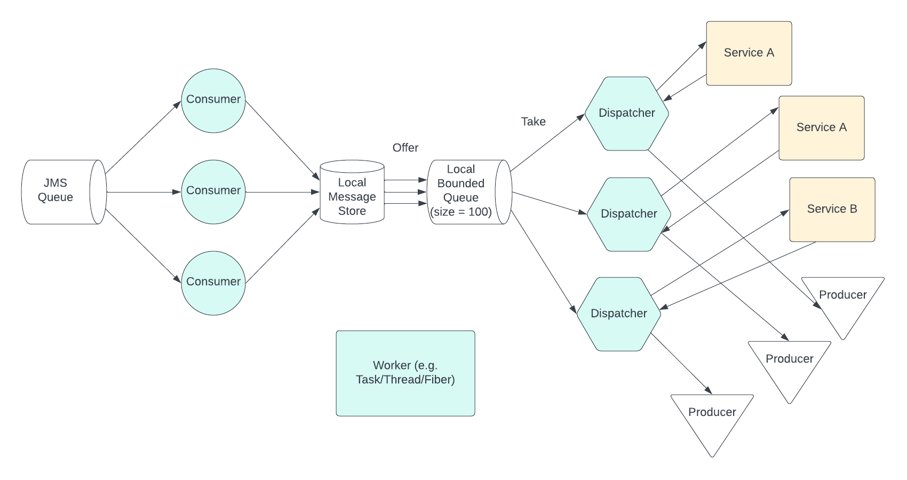

# Pan-Archival Catalogue Services
A message-based API for Pan-Archival Catalogue (PAC) services.

The PAC API is implemented using Cats Effect, to provide an asynchronous runtime, and an asynchronous   communications protocol (JMS). The reason for using an asynchronous protocol, rather than a synchronous one, like HTTP, is to ensure strong decoupling between the service and client systems. Strongly decoupled systems are much less likely to experience cascading failures, where the failure of one system causes others to fail, and are much less likely to become overloaded by too many requests.

## Cats Effect services



## Services
### Echo Service
* Service Identifier (SID): ECHO001
* Description: The echo service accepts a text message which it returns to the sender
* Request Queue: request-general
* Reply Queue: omega-editorial-web-application-instance-1
* Message Format: plain text

## Pre-requisites for building and running the project
* [Git](https://git-scm.com)
* [Docker](https://docs.docker.com/get-docker/)
* [ElasticMQ](https://github.com/softwaremill/elasticmq)
* [sbt](https://www.scala-sbt.org/) >= 1.6.2
* [Scala](https://www.scala-lang.org/) >= 2.13.8
* [Java JDK](https://adoptopenjdk.net/) >= 1.8

## Building and running locally

Steps:

1. Clone the Git repository:
```
git clone https://github.com/nationalarchives/ctd-omega-services-prototype.git
```
2. Switch to the newly created directory:
```
cd ./ctd-omega-services
```
3. For setting up ElasticMQ, install and start Docker Desktop according to the operating system from here: https://docs.docker.com/desktop/

    For Linux, Install the docker-engine from https://docs.docker.com/engine/install/#server and docker-compose from https://docs.docker.com/compose/install/ respectively.

4. From the `ctd-omega-services` project root and run `docker-compose.yml` in console as below:
```
docker-compose up -d
```
5. Run the `docker` command to verify the docker instance is running for ElasticMQ as below:
```
docker ps -a
```
6. Go to http://localhost:9325/ in a web browser and you should see the message queues configured in `custom.conf`, e.g. `request-general` and `omega-editorial-web-application-instance-1`
 
7. To run the unit tests you can use `sbt test`. 

8. To run the Pan-Archival Catalogue Services locally you can use ` sbt run`. Note that the queue names configured in the `application.conf` file used by application must match those in the `custom.conf` file used by ElasticMQ.

9. Your message service is now running and ready to respond to requests.
## Testing
Unit tests can be run from sbt using `sbt test`

Integration tests can be run from sbt using `sbt it:test`.

Note that before running the integration tests you need to start the Docker container for ElasticMQ. This can be started by running the following command from the project root directory:
```
docker-compose up -d
```
## Packaging
This project makes use of the [sbt-native-packager](https://www.scala-sbt.org/sbt-native-packager/index.html) plugin to create distribution packages of the application.

In order to create a zip package, which includes the application bundled as a jar file, together with its dependent jar files and also scripts to start the application, run the following sbt command:
```
sbt universal:packageBin
```
The zip file will be created in the `./target/universal` directory of the project.
It is also possible to preview the distribution using by running:
```
sbt stage
```
This creates the package files in the `./target/universal/stage` directory from where they can be examined and tested.

It is also possible to build a local Docker image of the application with the following command:
```
sbt docker:publishLocal
```
You can verify the existence of the Docker image by running the following from the command line:
```  
docker image ls
```
It is recommended to [read more about the Docker Plugin](https://www.scala-sbt.org/sbt-native-packager/formats/docker.html) if you wish yo use this feature. 
## Running the packaged application
When the application has been packaged as described above, the following directory structure will be created in the distribution:
```
│
└─bin
│   ctd-omega-services
│   ctd-omega-services.bat
└─lib
uk.gov.nationalarchives.ctd-omega-service.jar
...
```
The `bin` folder contains the scripts to start the application from the command line and the `lib` folder contains the application jar file and other dependencies.

Run the application from the command line using the `ctd-omega-services` script or `ctd-omega-service.bat` Windows batch file.