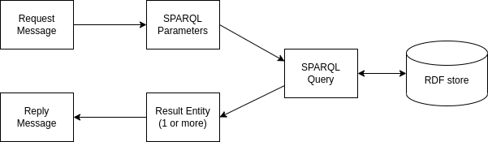

## SPARQL Queries and Parameterization

As the Pan-Archival Catalogue Services (PACS) rely on an RDF store to hold the catalogue data, the W3C recommended
[SPARQL Query Language](https://www.w3.org/TR/sparql11-query/) is the standardised way to query this data.

The SPARQL queries used by PACS are kept in the `src/main/resources/sparql` directory of the project.

An architectural decision was made to keep the SPARQL in separate files with the standard `.rq` SPARQL file extension,
rather than embed the SPARQL into the Scala source code that makes up PACS. This allows the queries to be developed,
tested and debugged in isolation from the rest of the application. It also means that queries can be developed by 
a data expert who may know SPARQL but not Scala. That being said, there is still a requirement to inject values into
these queries from within the application so that they can be re-used to handle query variations.

Within PACS we use the [Apache Jena ARQ API](https://jena.apache.org/documentation/query/index.html) to manage and
manipulate the RDF data within the data store. This library includes a [ParameterizedSparqlString](https://jena.apache.org/documentation/javadoc/arq/org.apache.jena.arq/org/apache/jena/query/ParameterizedSparqlString.html)
class which forms the basis of our approach to query parameterization. One nice feature of `ParameterisedSparqlString`
is that it can be initialised with an existing query and then used to replace variables within the query with
specific values. For example, the following query, which will select all RDF triples in the RDF store, can be 
parameterized by replacing `?predicateParam` with `dct:type`:
```sparql
PREFIX dct: <http://purl.org/dc/terms/>

SELECT ?subject ?object
WHERE { ?subject ?predicateParam ?object . }
```
This will transform the query to create the following query which will only select triples describing the subject types:
```sparql
PREFIX dct: <http://purl.org/dc/terms/>

SELECT ?subject ?object 
WHERE { ?subject dct:type ?object . }
```
Whereas the original query will return the subject and object of all RDF triples in the database, the second will only
return those that are joined by a `dct:type` property. This would give results similar to the following (please refer to the
[Omega Catalogue Data Model](https://github.com/nationalarchives/tna-cat/blob/master/Omega/documents/omega-catalogue-data-model/original/rendered/Omega%20Catalogue%20Data%20Model.pdf)
for more information about what these results mean):

| Subject | Object |
|------------------------|------------------------|
| cat:COAL.2022.N373.P   | cat:record-concept     |
| cat:COAL.2022.N37S.P   | cat:item               |
| cat:COAL.2022.N373.P.1 | cat:record-description |
| cat:COAL.2022.N373.P.1 | cat:item               |

Any part of the SPARQL describing triples can be replaced using the `ParamterizedSparqlString` and all the usual data
types seen in RDF are supported, e.g. literals such as string, integer and boolean as well as URIs such as `dct:type`.
It also supports the parameterization of `VALUES` statements within the SPARQL, but it does not support addition of
`FILTER` statements and so a mechanism was added to allow this which follows the same syntactic style.

Within PACS, a request message needs to be converted into SPARQL parameters which are then injected into the SPARQL
query. The query is then executed and the results are decoded into simple case classes via a typeclass derivation
mechanism provided by the [sparql-utils](https://github.com/phenoscape/sparql-utils) library. These simple case
classes are then converted into the more complex case classes representing the reply messages. Sometimes it will
require execution of more than one SPARQL query, in order to gather all the information expected in the reply. This 
loose coupling between request messages and queries encourages the modularisation and reuse of queries to feed diverse
requests.




### Writing queries for parameterization

There are a few stylistic points to note when writing queries for parameterization. Firstly, it is recommended to 
indicate which variables within the SPARQL are candidates for parameterization. This can be done simply by adding the
suffix `Param` to the variable. For example, in the following query we are indicating that we expect the `subjectParam`
variable to be supplied:
```
SELECT ?predicate ?object 
WHERE { ?subjectParam ?predicate ?object . }
```
This also works for `VALUES` statements which can be written as follows:
```
VALUES (?agentType) {?agentTypeValuesParam} 
```
These will be rewritten when parameterized, for example:
```
VALUES (?agentType) {(cat:person-concept>) (cat:corporate-body-concept>)}
```
`FILTER` statements can be parameterized simply by indicating where the `FILTER` should apply. For
example in the following case:
```
SELECT DISTINCT ?identifier ?currentVersion
WHERE {
  ?identifier       ver:currentVersion      ?currentVersion .
  ?currentVersion   prov:generatedAtTime    ?versionTimestamp .
  ?filterParam
}
```
The `filterParam` SPARQL variable can be replaced with a filter statement such as:
```
SELECT DISTINCT ?identifier ?currentVersion
WHERE {
  ?identifier       ver:currentVersion      ?currentVersion .
  ?currentVersion   prov:generatedAtTime    ?versionTimestamp .
  FILTER(?versionTimestamp >= xsd:dateTime("2023-07-01T17:30:00.000Z"))
}
```
If the filter parameter is not needed it can be removed simply by setting `filterParam` to be an empty
string.

More examples of parameterization can be seen in the tests in [RepositoryUtilsSpec](../src/test/scala/uk/gov/nationalarchives/omega/api/repository/RepositoryUtilsSpec.scala).